## 软件测试—鞍点

### 一、项目描述

#### 1、功能描述

​	鞍点是在所在行中是最大数、在所在列中是最小数

​	在一个 **元素都不相等** 的矩阵里面寻找鞍点，有鞍点输出鞍点所在的行和列以及鞍点，没有输出“not found!”

#### 2、开发环境版本

​	C、Visual Studio 2019

#### 3、提交部门

​	ORPHAN

#### 4、设计流程图

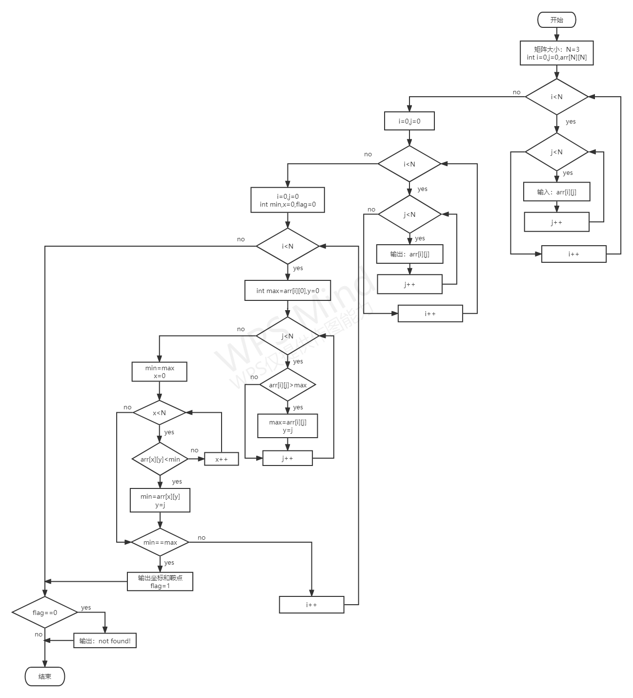

#### 5、逆向工程恢复的流程图

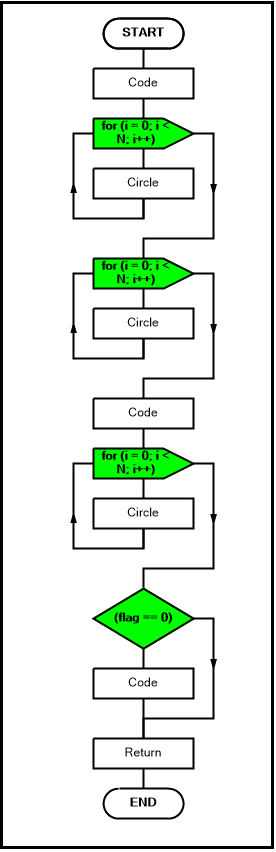

### 二、测试环境说明

该项目代码由C语言编写而成，所以运行测试环境须有C语言环境

### 三、测试用例和结果

| 用例序号 | 测试数据                                   | 预期结果                        | 实际结果                                                     | 标识（1—正确、0—错误） | 结果说明                   |
| -------- | ------------------------------------------ | ------------------------------- | ------------------------------------------------------------ | ---------------------- | -------------------------- |
| 1        | 1，1，1 2，2，2 3，3，3          | not found!                      | 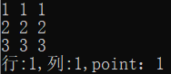 | 0                      | 实际不存在鞍点             |
| 2        | 1，1，2 1，1，2 1，1，2          | not found!                      | 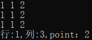 | 0                      | 实际不存在鞍点             |
| 3        | 1，3，2 1，3，2 1，3，2          | not found!                      | 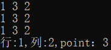 | 0                      | 实际不存在鞍点             |
| 4        | 1，1，1 1，1，1 1，1，1          | not found!                      | 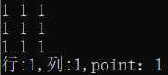 | 0                      | 实际不存在鞍点             |
| 5        | 09，10，20 12，15，14 19，18，16 | not found!                      | 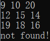 | 1                      | 达到预期结果               |
| 6        | 1，2，3 1，2，4 1，2，4          | not found!                      | 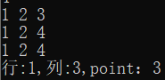 | 0                      | 含有形同元素，不能输出鞍点 |
| 7        | 1，2，3 2，3，4 4，5，6          | not found!                      | 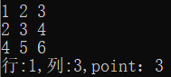 | 0                      | 含有形同元素，不能输出鞍点 |
| 8        | 5，5，4 4，4，4 1，2，3          | not found!                      | 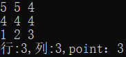 | 0                      | 含有形同元素，不能输出鞍点 |
| 9        | 1，5，8 2，3，6 3，4，5          | not found!                      | 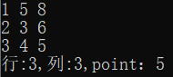 | 0                      | 含有形同元素，不能输出鞍点 |
| 10       | 09，10，20 12，15，14 03，02，01 | 行: 3 列: 1 point: 3  | 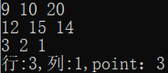 | 1                      | 达到预期结果               |
| 11       | 25，10，20 10，15，19 26，27，21 | not found!                      | 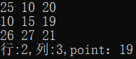 | 0                      | 含有形同元素，不能输出鞍点 |
| 12       | 31，32，33 30，20，10 37，36，35 | 行：2 列：1 point: 30 | 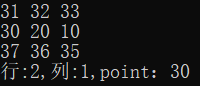 | 1                      | 达到预期结果               |

### 四、缺陷报告

| 测试用例数量 | 正确用例数量 | 错误用例数量 | 正确率 |
| ------------ | ------------ | ------------ | ------ |
| 12           | 3            | 9            | 25%    |

问题一：矩阵中列、行含有相同的数，依然能够输出鞍点，没有判断条件

问题二：矩阵中含有相同的数，依然执行，获取输出鞍点，没有判断条件
