# GPA皇榜数据库说明文档

[TOC]

## 一、基本表（规则—约束—触发器）

### 1、数据库二维表(对象)及属性设计初稿


#### （1）表的基本概念

​        表是包含数据库中所有数据库的对象。其中每一行代表一条唯一的记录，每一列代表记录中的一个字段。表中的数据。表中的数据库对象包含列，索引和触发器。
**列（Columns）：**也称属性列，再具体创建表时，必须指定列的名字和数据类型。
**索引（Indexes）：**是根据指定的数据库表列建立起来的顺序，提供了快速访问数据的途径，且可以监督表的数据，使其索引所指向的列中的数据不重复。
**触发器（Triggers）：**是指用户定义的事务命令的集合，当对一个表中的数据进行插入、更新或删除时这组命令就会自动执行，可以用来确保数据的完整性和安全性。

#### （2）表的约束

​        所谓完整性是指数据库的准确性与唯一性和一致性，而完整性检查就是检查数据的准确性和唯一性。MySQL数据库管理系统提供了一些机制来检查数据库表中的数据是否满足规定的条件，以保证数据库表中数据的准确性和一致性，这种机制就是约束。

**完整性约束：**
NOT NULL：约束字段不能为空
DEFAULT：设置字段默认值
UNIQUE KEY：约束字段的值唯一
PRIMARY KEY：约束字段为表的主键
FOREIGN KEY：约束字段为表的外键

#### （3）表的触发器

​        触发器是一种特殊的存储过程，它的执行不是由程序调用，也不是手工启动，而是由事件来触发的，例如，当对一个表进行操作（insert、delete、update）时就会激活触发器的执行。

​        与存储过程相比，触发器的作用更多的是维护数据完整性，经常用于加强数据的完整性约束和业务规则等。触发器可以从DBA_TRIGGERS和USER_TRIGGERS数据字典中查到。在SQL Server 2016中，触发器可以分为两大类：DDL触发器和DML触发器。当服务器或数据库中发生数据定义语言（DDL）事件时，将调用DDL触发器。当数据库中发生数据操作语言（DML）事件时，将调用DML触发器。DML事件包括在指定表或视图中修改数据的INSERT语句、UPDATE语句或DELETE语句。DML触发器可以查询其他表，还可以包含复杂的T-SQL语句。

**触发器作为一种非程序调用的存储过程，在应用过程中具有下列优势：**

a.预编译、已优化、效率较高，避免了SQL语句在网络传输后再解释的低效率。
b.可以重复使用，减少了开发人员的工作量。若使用SQL语句，使用一次就得编写一次。
c.业务逻辑封装性好，数据库中的很多问题都可在程序代码中实现，但是将其分离出来在数据库中处理，在逻辑上更清晰，对于后期维护和二次开发的作用比较明显。
d.安全。不会有SQL语句注入问题。

### 2、数据库基本表具体说明

#### （1）通讯录/phone_book

​	说明：存放教师或者学生的联系方式

- **字段设计**

  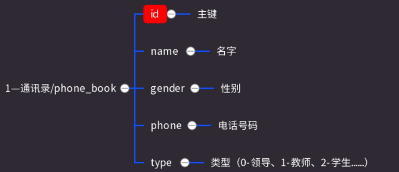

- **数据库二维表表头截图**

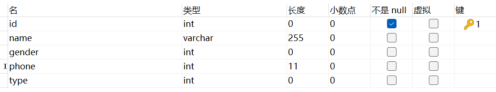

- **规则**

  规则1：性别固定为男(0)或女(1)

  规则2：电话号码为11位

- **约束**

  | 列名      | 说明             | 数据类型           | 长度    | 约束                |
  | --------- | ---------------- | ------------------ | ------- | ------------------- |
  | id        | 通讯录ID         | 整型               | default | 主键                |
  | name      | 姓名             | 普通编码字长字符串 | 255     | NULL                |
  | gender    | 性别             | 整型               | default | 字段默认值为女(1)   |
  | phone     | 电话号码         | 整型               | 11      | NULL                |
  | type      | 电话所属身份     | 整型               | default | 字段默认值为学生(2) |
  | only_code | 官牌号（唯一ID） | 普通编码字长字符串 | 255     | NULL                |

- **触发器**

  说明：该表由管理员直接创建，与其它表无关系，无需创建触发器

#### （2）思想学习/learning_center

​	说明：存放教师或者学生的思想报告

- **字段设计**

  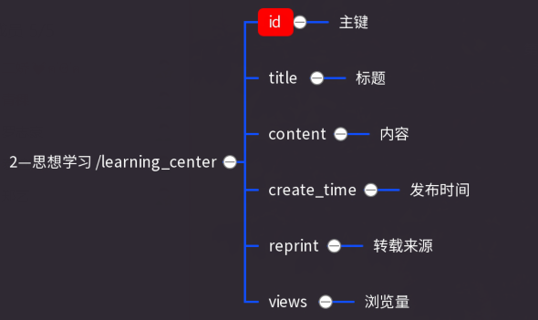

- **数据库二维表表头截图**

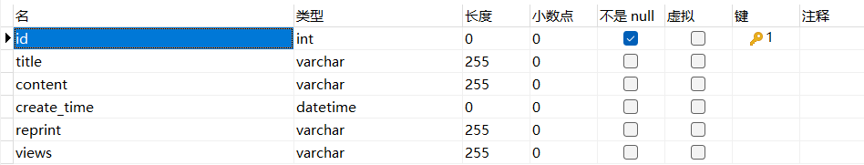

- **规则**

  规则1：发布时间应小于当前时间

  规则2：浏览量大于等于0

- **约束**

  | 列名        | 说明       | 数据类型           | 长度    | 约束          |
  | ----------- | ---------- | ------------------ | ------- | ------------- |
  | id          | 思想学习ID | 整型               | default | 主键          |
  | title       | 标题       | 普通编码字长字符串 | 255     | NULL          |
  | content     | 内容       | 普通编码字长字符串 | 255     | NULL          |
  | create_time | 发布时间   | 整型               | default | NULL          |
  | reprint     | 转载来源   | 普通编码字长字符串 | 255     | NULL          |
  | views       | 浏览量     | 普通编码字长字符串 | 255     | 字段默认值为0 |

- **触发器**

  说明：该表由管理员直接创建，与其它表无关系，无需创建触发器


#### （3）系统通知/system_not

​	说明：存放系统管理员、教师或者班委发送的通知

- **字段设计**

  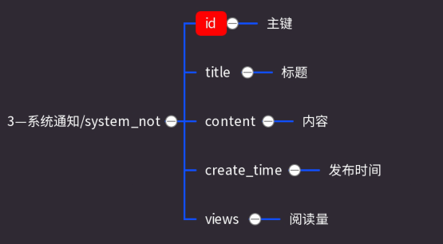

- **数据库二维表表头截图**

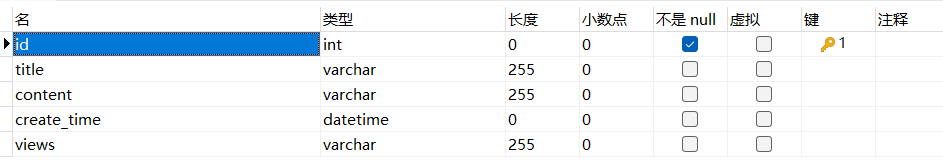

- **规则**

  规则1：发布时间应小于当前时间

  规则2：阅读量大于等于0

- **约束**

  | 列名        | 说明       | 数据类型           | 长度    | 约束          |
  | ----------- | ---------- | ------------------ | ------- | ------------- |
  | id          | 思想学习ID | 整型               | default | 主键          |
  | title       | 标题       | 普通编码字长字符串 | 255     | NULL          |
  | content     | 内容       | 普通编码字长字符串 | 255     | NULL          |
  | create_time | 发布时间   | 整型               | default | NULL          |
  | views       | 阅读量     | 普通编码字长字符串 | 255     | 字段默认值为0 |

- **触发器**

  说明：该表由管理员直接创建，与其它表无关系，无需创建触发器

#### （4）任务时间/task_time

说明：推送考研、期末、英语四级倒计时的时间

- **字段设计**

  

- **数据库二维表表头截图**

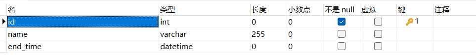

- **规则**

  规则1：发布时间应小于当前时间

- **约束**

  | 列名     | 说明         | 数据类型           | 长度    | 约束 |
  | -------- | ------------ | ------------------ | ------- | ---- |
  | id       | 任务时间ID   | 整型               | default | 主键 |
  | name     | 推送所属类型 | 普通编码字长字符串 | 255     | NULL |
  | end_time | 截止时间     | 整型               | default | NULL |
  
- **触发器**

  说明：该表由管理员直接创建，与其它表无关系，无需创建触发器

#### （5）用户/user

​	说明：存放用户的个人信息

- **字段设计**

  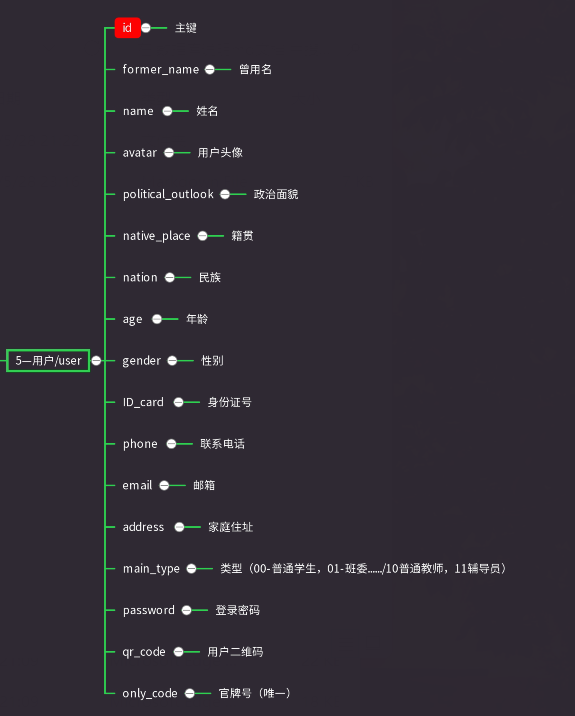

- **数据库二维表表头截图**

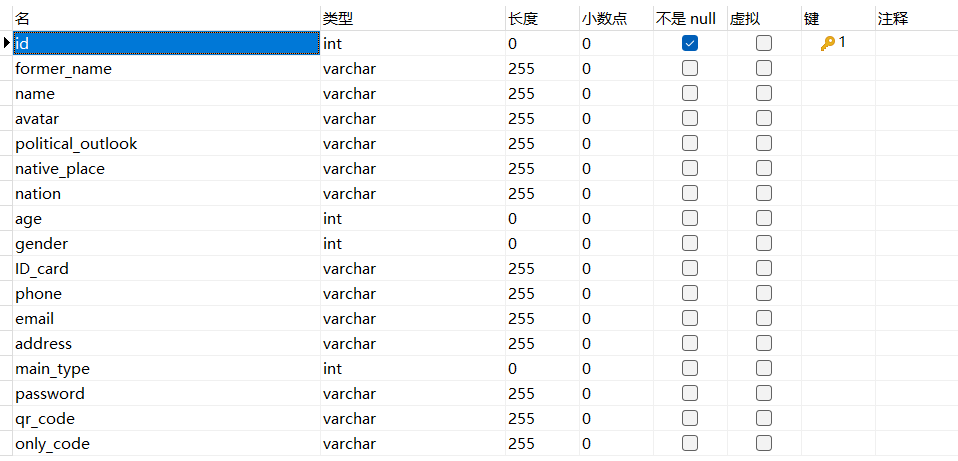

- **规则**

  规则1：年龄大于0

  规则2：性别固定为男(0)或女(1)

  规则3：身份证号为18位

  规则4：电话号码为11位

- **约束**

  | 列名              | 说明             | 数据类型           | 长度    | 约束                 |
  | ----------------- | ---------------- | ------------------ | ------- | -------------------- |
  | id                | 用户ID           | 整型               | default | 主键                 |
  | former_name       | 曾用名           | 普通编码字长字符串 | 255     | NULL                 |
  | name              | 姓名             | 普通编码字长字符串 | 255     | NULL                 |
  | avatar            | 用户头像         | 普通编码字长字符串 | 255     | NULL                 |
  | political_outlook | 政治面貌         | 普通编码字长字符串 | 255     | NULL                 |
  | native_place      | 籍贯             | 普通编码字长字符串 | 255     | NULL                 |
  | nation            | 民族             | 普通编码字长字符串 | 255     | NULL                 |
  | age               | 年龄             | 整型               | default | NULL                 |
  | gender            | 性别             | 整型               | default | 字段默认值为女(1)    |
  | ID_card           | 身份证号         | 普通编码字长字符串 | 255     | NULL                 |
  | phone             | 联系电话         | 普通编码字长字符串 | 255     | NULL                 |
  | email             | 邮箱             | 普通编码字长字符串 | 255     | NULL                 |
  | address           | 家庭住址         | 普通编码字长字符串 | 255     | NULL                 |
  | main_type         | 所属身份         | 整型               | default | 字段默认值为学生(00) |
  | password          | 登录密码         | 普通编码字长字符串 | 255     | NULL                 |
  | qr_code           | 用户二维码       | 普通编码字长字符串 | 255     | NULL                 |
  | only_code         | 官牌号（唯一ID） | 普通编码字长字符串 | 255     | NULL                 |

- **触发器**

  说明：涉及用户表的表项分别是学生表、教师表、用户-好友表、组织表、组织-成员表、说说动态表、评论表、点赞表、转发表

  触发器1：当用户表数据更新时，查找以下表中的user_id实现同步更新
  
  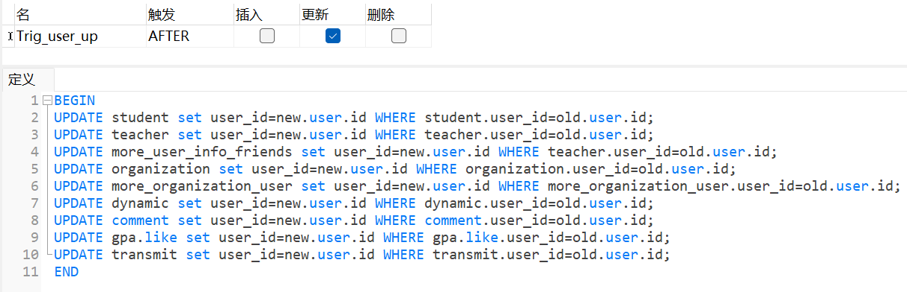
  
  触发器2：当删除用户表某行数据时，以下表中对应相同user_id的数据也会删除
  
  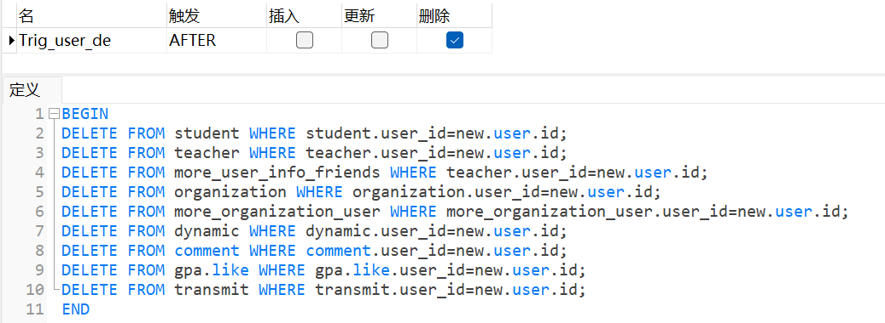
  
  触发器3：当用户表插入一条学生/教师类型的数据时，对应学生/教师表会插入数据
  
  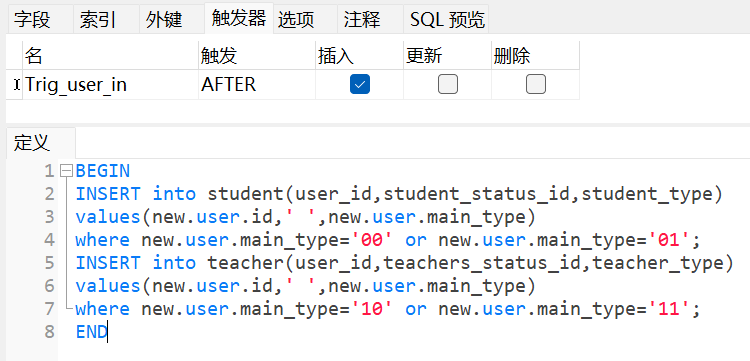

#### （6）学生/student

​	说明：学生基础信息

- **字段设计**

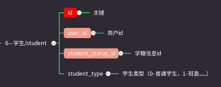

- *数据库二维表表头截图**

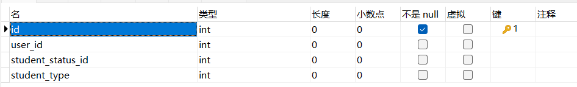

- **规则**

  规则1：学生身份固定为普通学生(0)或班委(1)

- **约束**

  | 列名              | 说明         | 数据类型 | 长度    | 约束                    |
  | ----------------- | ------------ | -------- | ------- | ----------------------- |
  | id                | 学生ID       | 整型     | default | 主键                    |
  | user_id           | 用户id       | 整型     | default | NULL                    |
  | student_status_id | 学籍信息id   | 整型     | default | NULL                    |
  | student_type      | 学生所属身份 | 整型     | default | 字段默认值为普通学生(0) |
  
- **触发器**

  说明：涉及学生表的表项分别是学籍信息表、教育背景表、家庭成员表、学生-课程表、学生成绩表

  触发器1：当学生数据更新时，查找以下表中的student_id实现同步更新
  
  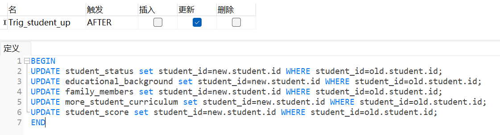
  
  触发器2：当删除学生表某行数据时，以下表中对应相同student_id的数据也会删除
  
  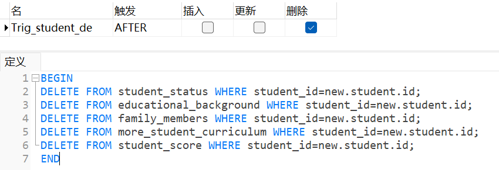

#### （7）教师/teacher

​	说明：教师基础信息

- **字段设计**

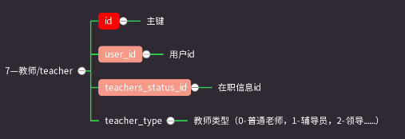

- *数据库二维表表头截图**

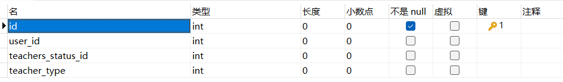

- **规则**

  规则1：老师身份固定为普通老师(0)或辅导员(1)或领导(2)

- **约束**

  | 列名              | 说明         | 数据类型 | 长度    | 约束                    |
  | ----------------- | ------------ | -------- | ------- | ----------------------- |
  | id                | 学生ID       | 整型     | default | 主键                    |
  | user_id           | 用户id       | 整型     | default | NULL                    |
  | teacher_status_id | 在职信息id   | 整型     | default | NULL                    |
  | teacher_type      | 教师所属身份 | 整型     | default | 字段默认值为普通老师(0) |

- **触发器**

  说明：涉及教师表的表项有在职信息表、教师-授课班级表、辅导员-管理班级表、考试系统账号表、阅卷分配表

  触发器1：当教师表数据更新时，查看以下表中的teacher_id实现同步更新
  
  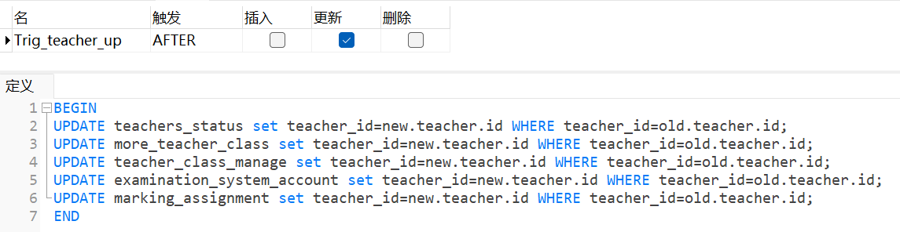
  
  触发器2：当删除教师表某行数据时，以下表中对应相同teacher_id的数据也会删除
  
  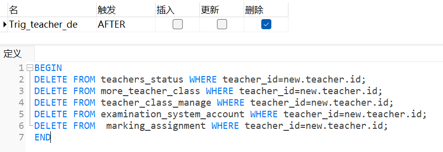

#### （8）管理员/admin

​	说明：管理员基础信息

- **字段设计**

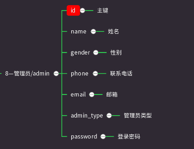

- *数据库二维表表头截图**

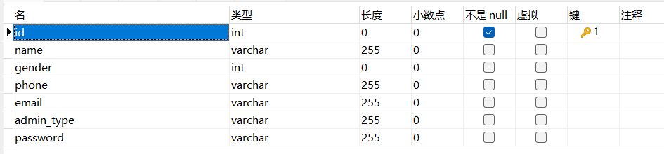

- **规则**

  规则1：性别固定为男(0)或女(1)

  规则2：电话号码为11位

- **约束**

  | 列名       | 说明       | 数据类型           | 长度    | 约束              |
  | ---------- | ---------- | ------------------ | ------- | ----------------- |
  | id         | 管理员ID   | 整型               | default | 主键              |
  | name       | 姓名       | 普通编码字长字符串 | 255     | NULL              |
  | gender     | 性别       | 整型               | default | 字段默认值为女(1) |
  | phone      | 联系电话   | 普通编码字长字符串 | 255     | NULL              |
  | email      | 邮箱       | 普通编码字长字符串 | 255     | NULL              |
  | admin_type | 管理员类型 | 普通编码字长字符串 | 255     | NULL              |
  | password   | 登录密码   | 普通编码字长字符串 | 255     | NULL              |

- **触发器**

  说明：该表项存储该软件的管理员信息，是一个独立存在的表项，由于权限限制，与其它表无关系，无需创建触发器

#### （9）学籍信息/student_status

​	说明：显示就读学校、所学专业、入学时间以及学号等信息

- **字段设计**

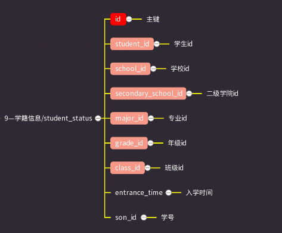

- *数据库二维表表头截图**

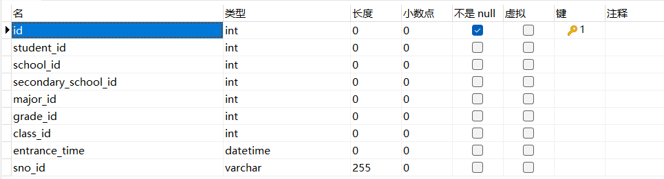

- **规则**

  规则1：入学时间需小于当前日期

- **约束**

  | 列名                | 说明       | 数据类型           | 长度    | 约束              |
  | ------------------- | ---------- | ------------------ | ------- | ----------------- |
  | id                  | 学籍信息id | 整型               | default | 主键              |
  | student_id          | 学生id     | 整型               | default | NULL              |
  | school_id           | 学校id     | 整型               | default | 字段默认值为女(1) |
  | secondary_school_id | 二级学院id | 整型               | default | NULL              |
  | major_id            | 专业id     | 整型               | default | NULL              |
  | grade_id            | 年级id     | 整型               | default | NULL              |
  | class_id            | 班级id     | 整型               | default | NULL              |
  | entrance_time       | 入学时间   | 整型               | default | NULL              |
  | sno_id              | 学号       | 普通编码字长字符串 | 255     | NULL              |

- **触发器**

  说明：涉及学习信息表的表项有：学生表、学籍变动记录表

  触发器1：当学籍信息id更新时，以下表中的student_status同步更新
  
  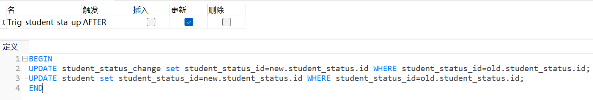
  
  触发器2：当删除某行数据时，以下表中对应相同student_status_id的数据也会删除
  
  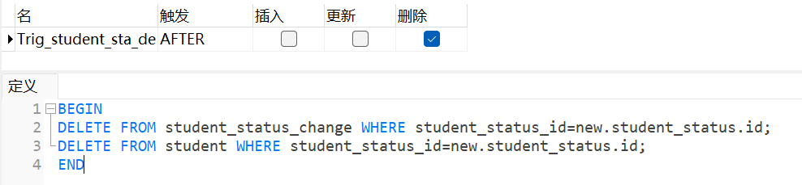

#### （10）学籍变动记录/student_status_change

​	说明：学籍审批流程

- **字段设计**

  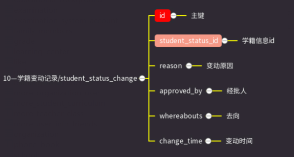

- **数据库二维表表头截图**

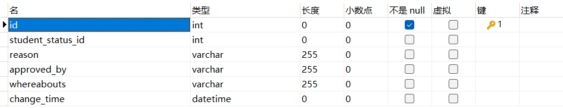

- **规则**

  规则1：变动时间需小于当前时间

- **约束**

  | 列名              | 说明           | 数据类型           | 长度    | 约束 |
  | ----------------- | -------------- | ------------------ | ------- | ---- |
  | id                | 学籍变动信息ID | 整型               | default | 主键 |
  | student_status_id | 学籍信息id     | 整型               | default | NULL |
  | reason            | 变动原因       | 普通编码字长字符串 | 255     | NULL |
  | approved_by       | 经批人         | 普通编码字长字符串 | 255     | NULL |
  | whereabouts       | 去向           | 普通编码字长字符串 | 255     | NULL |
  | change_time       | 变动时间       | 整型               | default | NULL |

- **触发器**

  说明：该表用于存放学籍信息变动记录，仅与学籍信息表有关，无需建立触发器

#### （11）教育背景/educational_background

​		说明：学生个人学习经历

- **字段设计**

  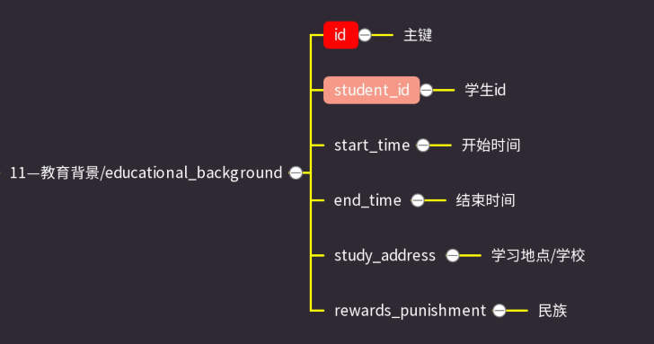

- **数据库二维表表头截图**

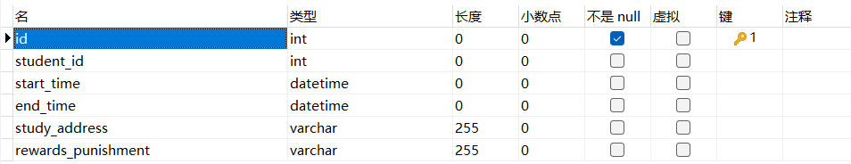

- **规则**

  规则1：开始时间不得大于结束时间

- **约束**

  | 列名               | 说明          | 数据类型           | 长度    | 约束 |
  | ------------------ | ------------- | ------------------ | ------- | ---- |
  | id                 | 教育背景ID    | 整型               | default | 主键 |
  | student_id         | 学生id        | 整型               | default | NULL |
  | start_time         | 开始时间      | 整型               | default | NULL |
  | end_time           | 结束时间      | 整型               | default | NULL |
  | study_address      | 学习地点/学校 | 普通编码字长字符串 | 255     | NULL |
  | rewards_punishment | 民族          | 普通编码字长字符串 | 255     | NULL |

- **触发器**

  说明：该表用于记录学生的教育背景信息，仅与学生表有关，无需建立触发器。

#### （12）家庭成员/family_members

​	说明：学生家庭成员个人信息

- **字段设计**

  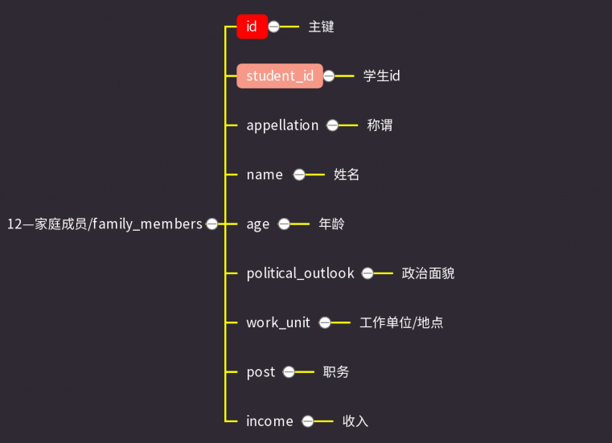

- **数据库二维表表头截图**

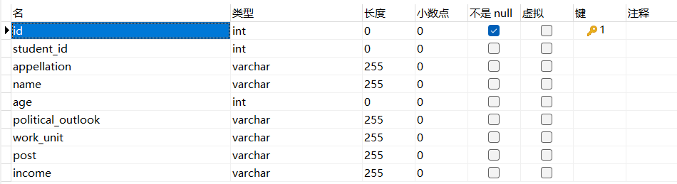

- **规则**

  规则1：年龄需要大于等于0

  规则2：收入需要大于等于0

- **约束**

  | 列名              | 说明          | 数据类型           | 长度    | 约束 |
  | ----------------- | ------------- | ------------------ | ------- | ---- |
  | id                | 家庭成员ID    | 整型               | default | 主键 |
  | student_id        | 学生id        | 整型               | default | NULL |
  | appellation       | 称谓          | 普通编码字长字符串 | 255     | NULL |
  | name              | 姓名          | 普通编码字长字符串 | 255     | NULL |
  | age               | 年龄          | 整型               | default | NULL |
  | political_outlook | 政治面貌      | 普通编码字长字符串 | 255     | NULL |
  | work_unit         | 工作单位/地点 | 普通编码字长字符串 | 255     | NULL |
  | post              | 职务          | 普通编码字长字符串 | 255     | NULL |
  | income            | 收入          | 普通编码字长字符串 | 255     | NULL |

- **触发器**

  说明：该表用于记录学生的家庭成员情况，仅与学生表有关，无需建立触发器。


#### （13）学生-课程/more_student_curriculum

​	说明：学生所上课程信息

- **字段设计**

  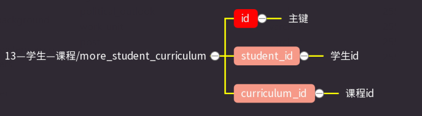

- **数据库二维表表头截图**

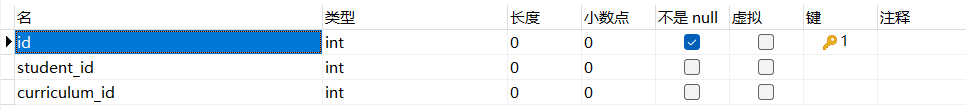

- **规则**

  无

- **约束**

  | 列名          | 说明        | 数据类型 | 长度    | 约束 |
  | ------------- | ----------- | -------- | ------- | ---- |
  | id            | 学生-课程ID | 整型     | default | 主键 |
  | student_id    | 学生id      | 整型     | default | NULL |
  | curriculum_id | 课程id      | 整型     | default | NULL |

- **触发器**

  说明：涉及学生-课程表的表项有学生成绩表

  触发器1：当学生课程表数据更新时，查找以下表中的more_student_curriculum_id实现同步更新
  
  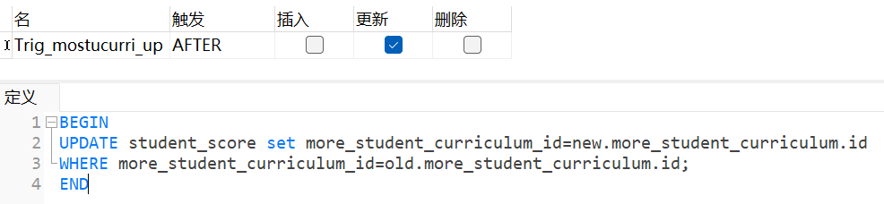
  
  触发器2：当删除学生-课程表某行数据时，以下表中对应相同more_student_curriculum_id的数据也会删除
  
  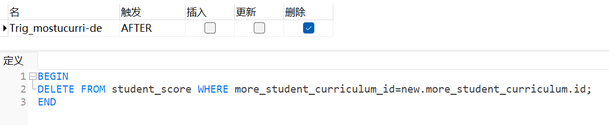

#### （14）学生成绩/student_score

​	说明：学生各科成绩详情信息

- **字段设计**

  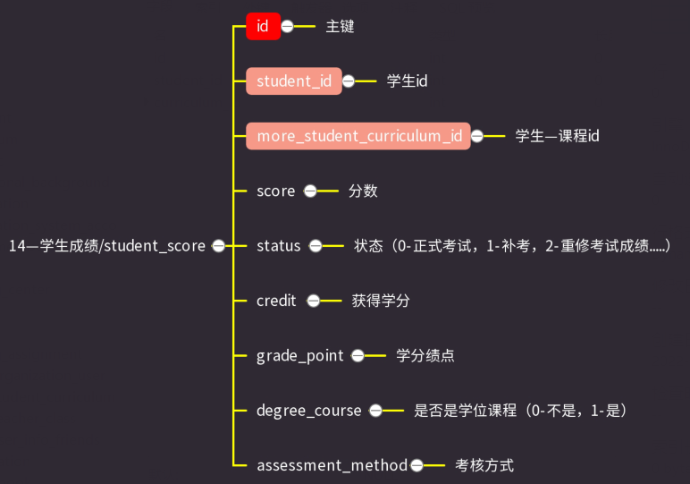

- **数据库二维表表头截图**

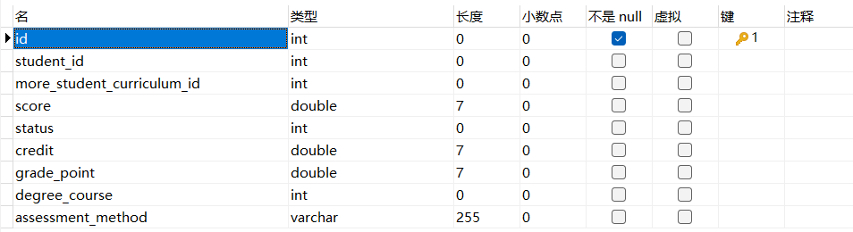

- **规则**

  规则1：分数需要大于等于0

  规则2：所修课程状态固定为正式考试(0)或补考(1)或重修考试成绩(2)

  规则3：获得学分需要大于等于0

  规则4：学分绩点需要大于等于0

  规则5：是否为学位课程固定为不是(0)或是(1)

- **约束**

  | 列名                       | 说明           | 数据类型           | 长度    | 约束                    |
  | -------------------------- | -------------- | ------------------ | ------- | ----------------------- |
  | id                         | 学生成绩ID     | 整型               | default | 主键                    |
  | student_id                 | 学生id         | 整型               | default | NULL                    |
  | more_student_curriculum_id | 学生-课程id    | 整型               | default | NULL                    |
  | score                      | 分数           | 双精度浮点型       | 7       | NULL                    |
  | status                     | 所修课程状态   | 整型               | 255     | 字段默认值为正式考试(0) |
  | credit                     | 获得学分       | 双精度浮点型       | 7       | NULL                    |
  | grade_point                | 学分绩点       | 双精度浮点型       | 7       | NULL                    |
  | degree_course              | 是否为学位课程 | 整型               | default | 字段默认值为是(1)       |
  | assessment_method          | 考核方式       | 普通编码字长字符串 | 255     | NULL                    |

- **触发器**

  说明：该表用于记录学生的所有成绩情况，仅与学生表有关，无需建立触发器。


#### （15）在职信息/teachers_status

​	说明：老师授课学校、学院以及专业详情

- **字段设计**

  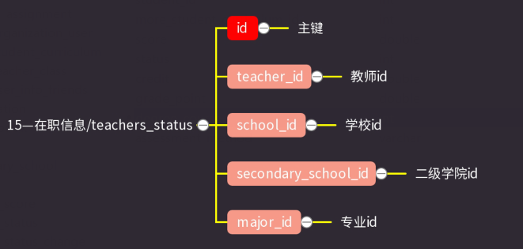

- **数据库二维表表头截图**

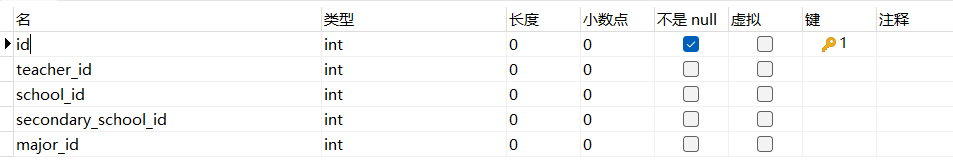

- **规则**

  无

- **约束**

  | 列名                | 说明       | 数据类型 | 长度    | 约束 |
  | ------------------- | ---------- | -------- | ------- | ---- |
  | id                  | 在职信息ID | 整型     | default | 主键 |
  | teacher_id          | 教师id     | 整型     | default | NULL |
  | school_id           | 学校id     | 整型     | default | NULL |
  | secondary_school_id | 二级学院id | 整型     | default | NULL |
  | major_id            | 专业id     | 整型     | default | NULL |

- **触发器**

  说明：涉及在职信息表的表项为教师表

  触发器1：当在职信息表数据更新时，查找以下表中的teacher_status_id实现同步更新
  
  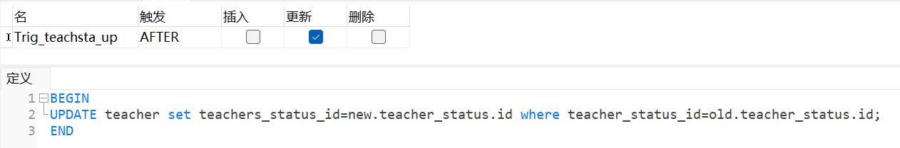
  
  触发器2：当删除在职信息表某行数据时，以下表中对应相同teacher_status_id的数据也会删除
  
  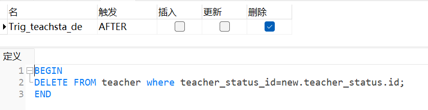

#### （16）教师-授课班级/more_teacher_class

​	说明：教师授课班级以及所授课程等信息

- **字段设计**

  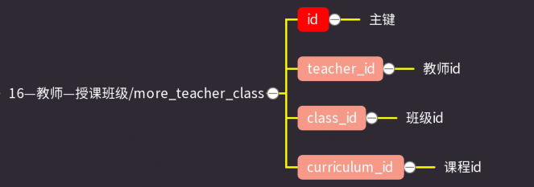

- **数据库二维表表头截图**


- **规则**

  无

- **约束**

  | 列名          | 说明            | 数据类型 | 长度    | 约束 |
  | ------------- | --------------- | -------- | ------- | ---- |
  | id            | 教师-授课班级ID | 整型     | default | 主键 |
  | teacher_id    | 教师id          | 整型     | default | NULL |
  | class_id      | 班级id          | 整型     | default | NULL |
  | curriculum_id | 课程id          | 整型     | default | NULL |
  
- **触发器**

  说明：该表用于存放教师的授课情况，仅与教师表有关，无需建立触发器。

#### （17）辅导员-管理班级/teacher_class_manage

​	说明：辅导员所管理的班级

- **字段设计**

  

- **数据库二维表表头截图**


- **规则**

  无

- **约束**

  | 列名       | 说明              | 数据类型 | 长度    | 约束 |
  | ---------- | ----------------- | -------- | ------- | ---- |
  | id         | 辅导员-管理班级ID | 整型     | default | 主键 |
  | teacher_id | 教师id            | 整型     | default | NULL |
  | class_id   | 班级id            | 整型     | default | NULL |
  
- **触发器**

  说明：该表用于存放辅导员管理班级的具体情况，仅与教师表有关，无需建立触发器。

#### （18）学校/school

​	说明：有关学校详情信息

- **字段设计**

  

- **数据库二维表表头截图**


- **规则**

  规则1：创办时间必须小于当前时间

- **约束**

  | 列名           | 说明             | 数据类型           | 长度    | 约束 |
  | -------------- | ---------------- | ------------------ | ------- | ---- |
  | id             | 学校ID           | 整型               | default | 主键 |
  | school_code    | 学校代码         | 普通编码字长字符串 | 255     | NULL |
  | name           | 名称             | 普通编码字长字符串 | 255     | NULL |
  | English_name   | 学校英文名称     | 普通编码字长字符串 | 255     | NULL |
  | school_address | 学校地址         | 普通编码字长字符串 | 255     | NULL |
  | creation_time  | 创办时间         | 时间类型           | default | NULL |
  | school_type    | 学校办学所属类型 | 整型               | default | NULL |

- **触发器**

  说明：涉及学校表的表项有:学籍信息表、在职信息表、二级学院表

  触发器1：当学校表数据更新时，查找以下表中的school_id实现同步更新
  
  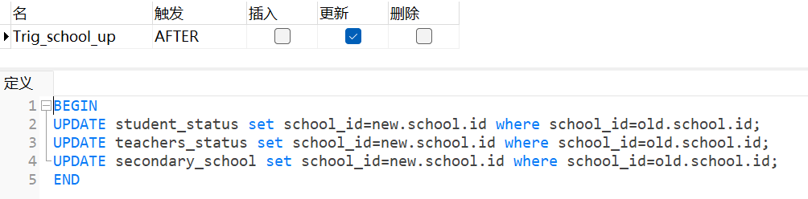
  
  触发器2：当删除学校表某行数据时，以下表中对应相同school_id的数据也会删除
  
  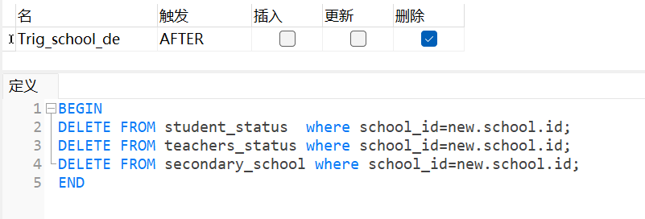

#### （19）二级学院/secondary_school

​	说明：有关二级学院详情信息

- **字段设计**

  

- **数据库二维表表头截图**


- **规则**

  规则1：创办时间必须小于当前时间

- **约束**

  | 列名                   | 说明           | 数据类型           | 长度    | 约束 |
  | ---------------------- | -------------- | ------------------ | ------- | ---- |
  | id                     | 二级学院ID     | 整型               | default | 主键 |
  | school_id              | 学校id         | 整型               | default | NULL |
  | name                   | 名称           | 普通编码字长字符串 | 255     | NULL |
  | grade                  | 等级           | 普通编码字长字符串 | 255     | NULL |
  | teaching_building_name | 所在教学楼名称 | 普通编码字长字符串 | 255     | NULL |
  | introduction           | 简介           | 普通编码字长字符串 | 255     | NULL |
  | creation_time          | 创办时间       | 时间类型           | default | NULL |

- **触发器**

  说明：涉及二级学院表的表项有：学籍信息表、在职信息表、专业表、课程表、考试安排表

  触发器1：当二级学院表数据更新时，查找以下表中的secondary_school_id实现同步更新
  
  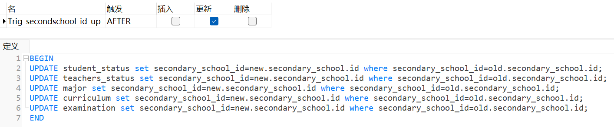
  
  触发器2：当删除二级学院表某行数据时，以下表中对应相同secondary_school_id的数据也会删除
  
  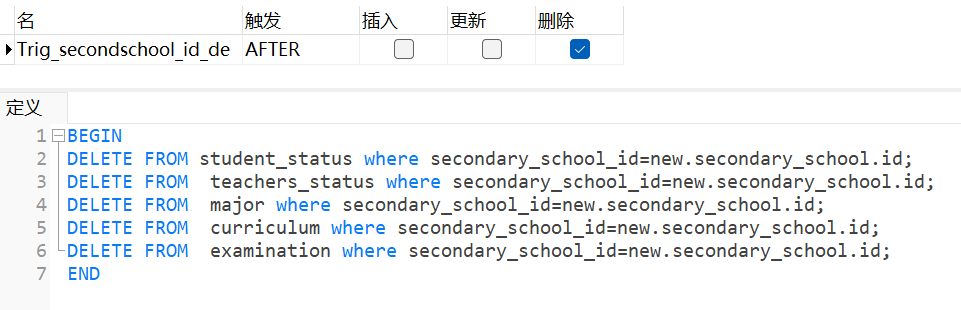

#### （20）专业/major

​	说明：有关专业详情信息

- **字段设计**

  

- **数据库二维表表头截图**


- **规则**

  规则1：创办时间必须小于当前时间

- **约束**

  | 列名                | 说明       | 数据类型           | 长度    | 约束 |
  | ------------------- | ---------- | ------------------ | ------- | ---- |
  | id                  | 专业ID     | 整型               | default | 主键 |
  | secondary_school_id | 二级学院id | 整型               | default | NULL |
  | name                | 名字       | 普通编码字长字符串 | 255     | NULL |
  | major_mode          | 专业代码   | 普通编码字长字符串 | 255     | NULL |
  | introduction        | 简介       | 普通编码字长字符串 | 255     | NULL |
  | creation_time       | 创办时间   | 时间类型           | default | NULL |

- **触发器**

  说明：涉及专业表的表项有：学籍信息表、在职信息表、课程表、考试安排表

  触发器1：当专业表数据更新时，查找以下表中的major_id实现同步更新
  
  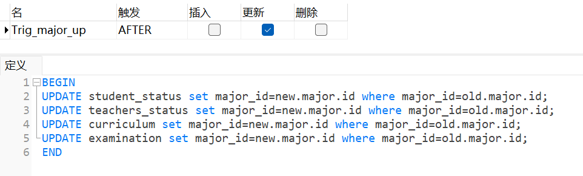
  
  触发器2：当删除专业表某行数据时，以下表中对应相同major_id的数据也会删除
  
  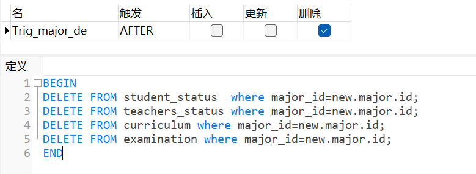

#### （21）年级/grade

​	说明：所在年级详情信息

- **字段设计**

  

- **数据库二维表表头截图**


- **规则**

  规则1：年级编号大于等于0

- **约束**

  | 列名       | 说明     | 数据类型           | 长度    | 约束 |
  | ---------- | -------- | ------------------ | ------- | ---- |
  | id         | 年级ID   | 整型               | default | 主键 |
  | name       | 年级名称 | 普通编码字长字符串 | 255     | NULL |
  | grade_code | 年级编号 | 普通编码字长字符串 | 255     | NULL |

- **触发器**

  说明：涉及年级表的表项有：学籍信息表、课程表、考试安排表

  触发器1：当年级表数据更新时，实现以下表中的grade_id实现同步更新
  
  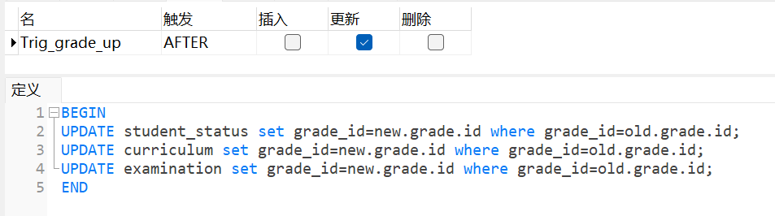
  
  触发器2：当删除年级表某行数据时，以下表中对应相同grade_id的数据也会删除
  
  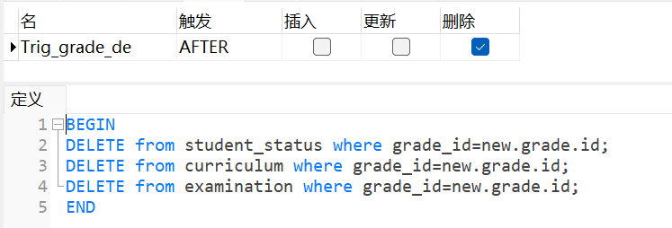

#### （22）班级/class

​	说明：所在班级详情信息

- **字段设计**

  

- **数据库二维表表头截图**


- **规则**

  规则1：班级编号大于等于0

- **约束**

  | 列名       | 说明     | 数据类型           | 长度    | 约束 |
  | ---------- | -------- | ------------------ | ------- | ---- |
  | id         | 班级ID   | 整型               | default | 主键 |
  | name       | 班级名称 | 普通编码字长字符串 | 255     | NULL |
  | class_code | 班级编号 | 普通编码字长字符串 | 255     | NULL |

- **触发器**

  说明：涉及班级表的表项有：学生学籍表、教师-授课表、辅导员-管理表、课程表、考试安排表

  触发器1：当班级表数据更新时，查看以下表中的class_id实现同步更新
  
  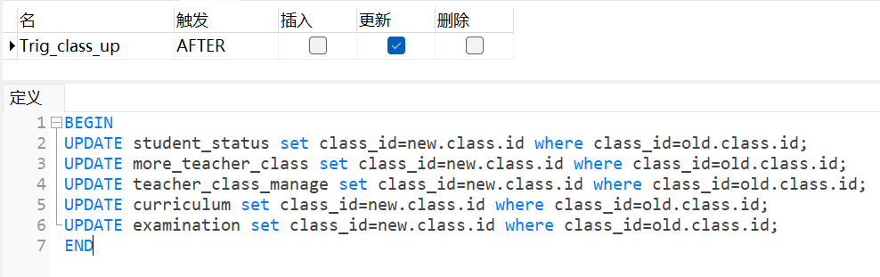
  
  触发器2：当删除班级表某行数据时，以下表中对应相同class_id的数据也会删除
  
  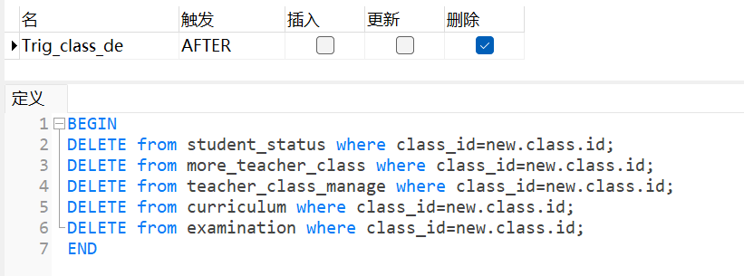

#### （23）课程/curriculum

​	说明：所修课程详情信息

- **字段设计**

  

- **数据库二维表表头截图**


- **规则**

  规则1：课程编号大于等于0

  规则2：开始时间与结束时间为同一天且开始时间不得大于结束时间

  规则3：学期开始时间不得大于结束时间

  规则4：学分大于等于0

- **约束**

  | 列名                | 说明         | 数据类型           | 长度    | 约束 |
  | ------------------- | ------------ | ------------------ | ------- | ---- |
  | id                  | 课程ID       | 整型               | default | 主键 |
  | secondary_school_id | 二级学院id   | 整型               | default | NULL |
  | grade_id            | 年级id       | 整型               | default | NULL |
  | major_id            | 专业id       | 整型               | default | NULL |
  | class_id            | 班级id       | 整型               | default | NULL |
  | name                | 课程名称     | 普通编码字长字符串 | 255     | NULL |
  | curriculum_code     | 课程编号     | 普通编码字长字符串 | 255     | NULL |
  | semester            | 学期         | 普通编码字长字符串 | 255     | NULL |
  | curriculum_teacher  | 任课老师     | 普通编码字长字符串 | 255     | NULL |
  | curriculum_place    | 上课地点     | 普通编码字长字符串 | 255     | NULL |
  | start_time          | 课程开始时间 | 时间类型           | default | NULL |
  | end_time            | 课程结束时间 | 时间类型           | default | NULL |
  | start_semester_time | 学期开始时间 | 时间类型           | default | NULL |
  | end_semester_time   | 学期结束时间 | 时间类型           | default | NULL |
  | credit              | 学分         | 双精度浮点型       | 7       | NULL |
  | curriculum_type     | 类型         | 普通编码字长字符串 | 255     | NULL |

- **触发器**

  说明：涉及课程表的表项有:学生-课程表、教师-课程表、考试安排表

  触发器1：当课程表数据更新时，查找以下表中的curriculum_id实现同步更新
  
  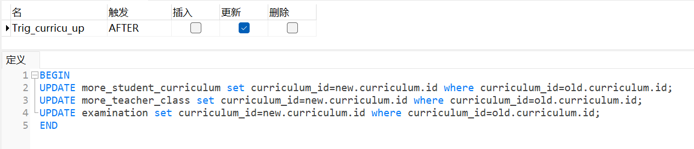
  
  触发器2：当删除课程表某行数据时，以下表中对应相同curriculum_id的数据也会删除
  
  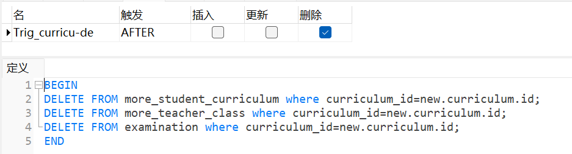

#### （24）考试系统账号/examination_system_account

​	说明：拥有权限的考试系统账号

- **字段设计**

  

- **数据库二维表表头截图**

  

- **规则**

  规则1：权限码唯一

- **约束**

  | 列名            | 说明           | 数据类型           | 长度    | 约束 |
  | --------------- | :------------- | ------------------ | ------- | ---- |
  | id              | 考试系统账号ID | 整型               | default | 主键 |
  | teacher_id      | 教师id         | 整型               | default | 外键 |
  | permission_code | 权限码         | 普通编码字长字符串 | default | NULL |

- **触发器**

  说明：该表用于存放考试系统的账号，这些账号对应改卷老师，其中的权限码为教研组自动分配，仅与教师表有关，无需建立触发器。

#### （25）考试安排/examination

​	说明：对于学生考试时间地点等的安排

- **字段设计**

  

- **数据库二维表表头截图**

  

- **规则**

  规则1：考试时间相同时，考试地点不能相同

  规则2：一个班级不能同时出现在两个不同地点

- **约束**

  | 列名                | 说明       | 数据类型           | 长度    | 约束 |
  | ------------------- | :--------- | ------------------ | ------- | ---- |
  | id                  | 考试安排ID | 整型               | default | 主键 |
  | secondary_school_id | 二级学院id | 整型               | default | NULL |
  | major_id            | 专业id     | 整型               | default | NULL |
  | grade_id            | 年级id     | 整型               | default | NULL |
  | class_id            | 班级id     | 整型               | default | NULL |
  | curriculum_id       | 课程id     | 整型               | default | NULL |
  | exam_code           | 考试编号   | 普通编码字长字符串 | 255     | NULL |
  | exam_name           | 考试名称   | 普通编码字长字符串 | 255     | NULL |
  | exam_time           | 考试时间   | 时间类型           | default | NULL |
  | exam_address        | 考试地点   | 普通编码字长字符串 | 255     | NULL |
  | exam_info           | 考试信息   | 普通编码字长字符串 | 255     | NULL |

- **触发器**

  说明：涉及考试安排表的表项有：考卷表

  触发器1：当考试安排表更新时，查找以下表中的examination_id实现同步更新
  
  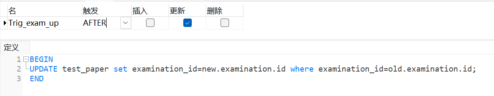
  
  触发器2：当删除考试安排表某行数据时，以下表中对应相同examination_id的数据也会删除
  
  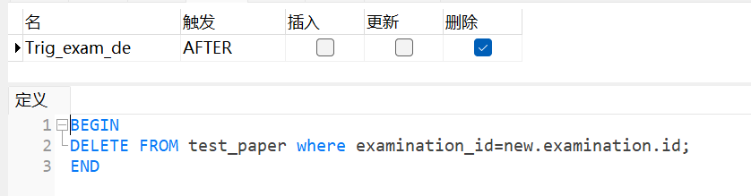

#### （26）考卷/test_paper

​	说明：考试试卷的相关信息

- **字段设计**

  

- **数据库二维表表头截图**

  

- **规则**

  规则1：分值大于等于0

- **约束**

  | 列名           | 说明         | 数据类型           | 长度    | 约束 |
  | -------------- | :----------- | ------------------ | ------- | ---- |
  | id             | 考卷ID       | 整型               | default | 主键 |
  | examination_id | 考试id       | 整型               | default | NULL |
  | img_url        | 试卷图片路径 | 普通编码字长字符串 | 255     | NULL |
  | score          | id           | 普通编码字长字符串 | 255     | NULL |
  | status         | 试卷状态     | 普通编码字长字符串 | 255     | NULL |

- **触发器**

  说明：涉及考卷表的表项有：考卷-题型设定表、阅卷分配表

  触发器1：当考卷表数据更新时，查找以下表中的test_paper_id实现同步更新
  
  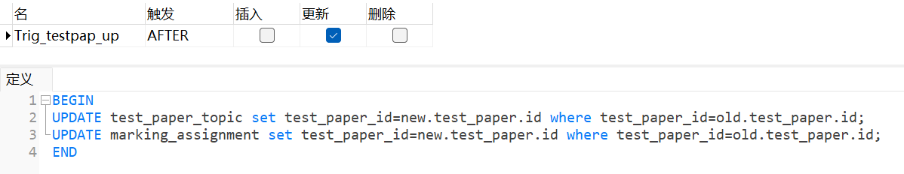
  
  触发器2：当删除考卷表某行数据时，以下表中对应相同test_paper_id的数据也会删除
  
  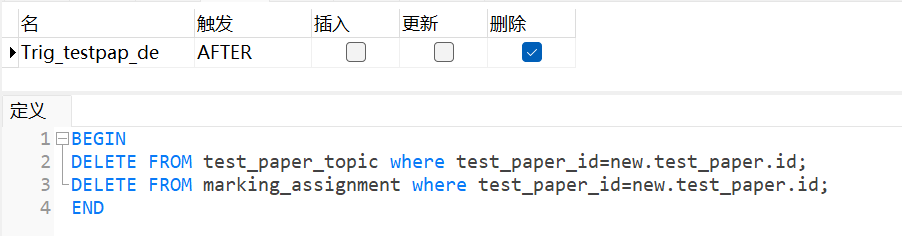

#### （27）考卷-题型设定/test_paper_topic

​	说明：考试试卷上的题型设定

- **字段设计**

  

- **数据库二维表表头截图**

  

- **规则**

  规则1：分值大于等于0

  规则2：题号大于0

- **约束**

  | 列名          | 说明            | 数据类型           | 长度    | 约束 |
  | ------------- | :-------------- | ------------------ | ------- | ---- |
  | id            | 考卷-题型设定ID | 整型               | default | 主键 |
  | test_paper_id | 试卷id          | 整型               | default | NULL |
  | topic_name    | 题名字          | 普通编码字长字符串 | 255     | NULL |
  | topic_code    |                 | 普通编码字长字符串 | 255     | NULL |
  | topic_type    | 题类型          | 普通编码字长字符串 | 255     | NULL |
  | score         | 分值            | 普通编码字长字符串 | 255     | NULL |
  | status        | 该题状态        | 普通编码字长字符串 | 255     | NULL |

- **触发器**

  说明：该表用于存放考卷的题型设置信息，仅与考卷表有关，无需创建触发器。

#### （28）阅卷分配/marking_assignment

​	说明：给教师分配改卷任务

- **字段设计**

  

- **数据库二维表表头截图**

  

- **规则**

  无

- **约束**

  | 列名          | 说明            | 数据类型           | 长度    | 约束 |
  | ------------- | :-------------- | ------------------ | ------- | ---- |
  | id            | 考卷-题型设定ID | 整型               | default | 主键 |
  | test_paper_id | 试卷id          | 整型               | default | 外键 |
  | teacher_id    | 教师id          | 整型               | default | 外键 |
  | end_id        | 截止时间        | 普通编码字长字符串 | 255     | NULL |
  | status        | 阅卷状态        | 普通编码字长字符串 | 255     | NULL |

- **触发器**

  说明：该表用于存放阅卷系统的信息，与教师表和考卷表有关，无需创建触发器。

#### （29）用户-好友/more_user_info_friends

​	说明：用户的好友

- **字段设计**

  

- **数据库二维表表头截图**

  

- **规则**

  规则1：官牌号唯一

- **约束**

  | 列名      | 说明        | 数据类型           | 长度    | 约束 |
  | --------- | :---------- | ------------------ | ------- | ---- |
  | id        | 用户-好友ID | 整型               | default | 主键 |
  | user_id   | 用户id      | 整型               | default | 外键 |
  | only_code | 官牌号      | 普通编码字长字符串 | default | 外键 |

- **触发器**

  说明：该表用于存放用户的好友信息，与用户表有关，涉及官牌号，无需创建触发器。

#### （30）组织/organization

​	说明：组织的相关信息

- **字段设计**

  

- **数据库二维表表头截图**

  

- **规则**

  规则1：组织码唯一

- **约束**

  | 列名              | 说明               | 数据类型           | 长度    | 约束 |
  | ----------------- | :----------------- | ------------------ | ------- | ---- |
  | id                | ID                 | 整型               | default | 主键 |
  | user_id           | 用户id             | 整型               | default | 外键 |
  | organization_name | 名称               | 普通编码字长字符串 | 255     | NULL |
  | organization_code | 组织码             | 普通编码字长字符串 | 255     | NULL |
  | qr_code           | 组织二维码图片路径 | 普通编码字长字符串 | 255     | NULL |

- **触发器**

  说明：涉及组织表的表项有：组织-成员表
  
  触发器1：当组织表数据更新时，查找以下表中的organization_id实现同步更新
  
  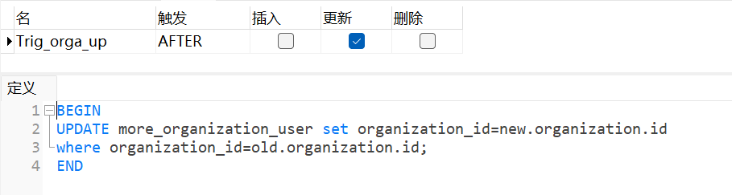
  
  触发器2：当删除组织表某行数据时，以下表中对应相同organization_id的数据也会删除
  
  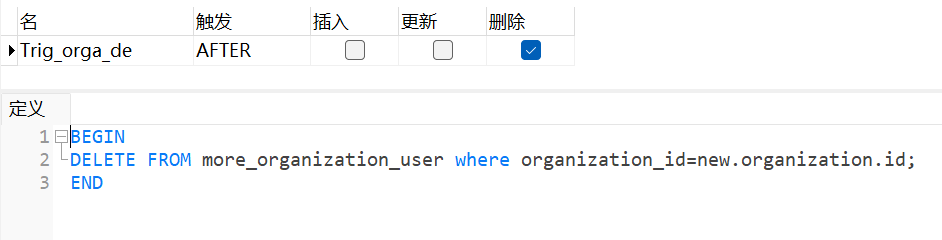

#### （31）组织-成员/more_organization_user

​	说明：组织成员相关信息

- **字段设计**

  

- **数据库二维表表头截图**

  

- **规则**

  无

- **约束**

  | 列名            | 说明     | 数据类型           | 长度    | 约束 |
  | --------------- | :------- | ------------------ | ------- | ---- |
  | id              | ID       | 整型               | default | 主键 |
  | organization_id | 组织id   | 整型               | default | 外键 |
  | user_id         | 用户id   | 整型               | default | 外键 |
  | type            | 成员类型 | 普通编码字长字符串 | 255     | NULL |

- **触发器**

  说明：该表用于存放组织成员的具体信息，与组织表和用户表有关，无需创建触发器。

#### （32）说说动态/dynamic

​	说明：说说的相关信息

- **字段设计**

  

- **数据库二维表表头截图**

  

- **规则**

  无

- **约束**

  | 列名        | 说明     | 数据类型           | 长度    | 约束 |
  | ----------- | :------- | ------------------ | ------- | ---- |
  | id          | ID       | 整型               | default | 主键 |
  | user_id     | 用户id   | 整型               | default | 外键 |
  | content     | 内容     | 普通编码字长字符串 | 255     | NULL |
  | label       | 标签     | 普通编码字长字符串 | 255     | NULL |
  | create_time | 发布时间 | 时间类型           | 0       | NULL |

- **触发器**

  说明：涉及说说动态表的表项有：评论表、点赞表、转发表
  
  触发器1：当说说动态表数据更新时，查找以下表中的dynamic_id实现同步更新
  
  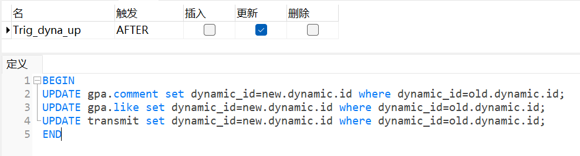
  
  触发器2：当删除说说动态表某行数据时，以下表中对应相同dynamic_id的数据也会删除
  
  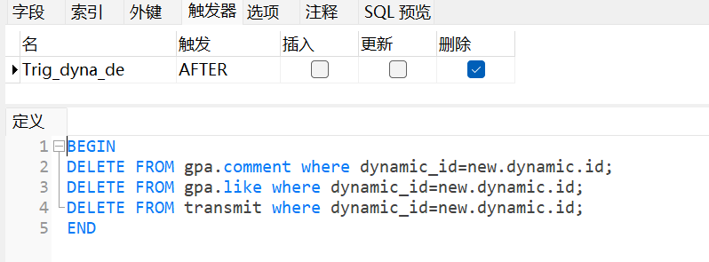

#### （33）评论/comment

​	说明：在说说下面进行评论

- **字段设计**

  

- **数据库二维表表头截图**

  

- **规则**

  规则1：官牌号唯一

- **约束**

  | 列名       | 说明       | 数据类型           | 长度    | 约束 |
  | ---------- | :--------- | ------------------ | ------- | ---- |
  | id         | ID         | 整型               | default | 主键 |
  | dynamic_id | 说说id     | 整型               | default | 外键 |
  | user_id    | 评论用户id | 整型               | default | 外键 |
  | content    | 内容       | 普通编码字长字符串 | 255     | NULL |

- **触发器**

  说明：该表用于存放说说动态表的某个涉及内容，即其它用户对该用户的某条动态的评论，与说说动态表、用户表有关，无需创建触发器。

#### （34）点赞/like

说明：点赞他人说说

- **字段设计**

  

- **数据库二维表表头截图**

  

- **规则**

  无

- **约束**

  | 列名       | 说明     | 数据类型 | 长度    | 约束 |
  | ---------- | -------- | -------- | ------- | ---- |
  | id         | 点赞ID   | 整型     | default | 主键 |
  | dynamic_id | 说说id   | 整型     | default | NULL |
  | user_id    | 点赞用户 | 整型     | default | NULL |

- **触发器**

  说明：该表用于存放说说动态表的某个涉及内容，即其它用户对该说说的点赞情况，与说说动态表、用户表有关，无需创建触发器。


#### （35）转发/transmit

​	说明：向他人转发说说

- **字段设计**

  

- **数据库二维表表头截图**

  

- **规则**

  无

- **约束**

  | 列名       | 说明     | 数据类型           | 长度    | 约束 |
  | ---------- | -------- | ------------------ | ------- | ---- |
  | id         | 转发ID   | 整型               | default | 主键 |
  | dynamic_id | 说说id   | 整型               | default | NULL |
  | user_id    | 转发用户 | 整型               | default | NULL |
  | content    | 内容     | 普通编码字长字符串 | 255     | NULL |

- **触发器**

  说明：该表用于存放说说动态表的某个涉及内容，即其它用户对该说说的转发情况，与说说动态表、用户表有关，无需创建触发器。

### 二、视图

### 1、关于视图

​    	在数据库三级模式中，模式是数据库中全体数据逻辑结构和特征的描述。当不同的用户或应用需要使用基本表中的不同数据，甚至一些经过聚集函数或表达式计算的值时，可以为其建立外模式。外模式中的数据来自于模式，是模式中的部分数据或者重构的数据。SQL语言支持关系数据厍的三级模式结构。正如模式对应着数据库中的基本表，外模式对应到数据库中的概念就是视图。

#### （1）视图的概念

​		视图（View）是由其他表或视图上的查询所定义的一种特殊表。下图显示了视图和基本表的对应关系。视图是数据库基本表中的部分行和部分列数据的组合。它与基本表不同的是，表中的数据是物理存储的，而数据库中并不存储视图所包含的数据，这些数据仍然存在于原来的基本表中。因此，视图就像一个窗口，为用户提供以多角度观察数据库中数据的一种机制。


**可以通讨以下几点来理解视图的概念：**

a.视图是查看数据库中数据的一种机制。
b.数据库中只存放视图的定义，不存放视图句含的数据，因此，视图是一种虚表，视图也不占用物理空间。
c.视图中引用的表称为视图的基本表。
d.定义视图后，就可以像基本表一样被查询和更新。但是对视图的查询与更新操作最终都会转换为对基本表的操作。
e.基于视图仍然可以创建视图。

#### （2）视图的作用

a.方便用户使用数据。
b.提供数据的安全性保护机制。
c.视图使用户能以多种角度看待同一数据，当许多不同种类的用户共享同一个数据库时，这种灵活性是非常必要的。
d.视图为数据提供了一定程度的逻辑独立性。

### 2、视图的具体说明

#### （1）获取指定类型人员的姓名、电话号码

1）创建视图

```sql
CREATE VIEW phone_book_info
AS
SELECT
	phone_book.`name`, 
	phone_book.phone, 
	phone_book.type
FROM
	phone_book
```


2）查询使用（获取老师的姓名、电话号码—类型字段：type=1）

```sql
SELECT * FROM phone_book_info WHERE type=1;
```


#### （2）获取所有班委的姓名、学号

- student学生中user_id和user用户表里面的id关联
- student_status学籍表中的student_id和student学生表中id关联

1）创建视图

```sql
CREATE VIEW phone_book_info
AS
SELECT
	`user`.`name`, 
	student_status.sno_id
FROM
	student
	INNER JOIN
	student_status
	ON 
		student.id = student_status.student_id
	INNER JOIN
	`user`
	ON 
		`user`.id = student.user_id
```


2）查询使用（获取老师的姓名、电话号码—类型字段：type=1）

```sql
SELECT * FROM get_classcon_info;
```


#### （3） 获取信息院19计科软件工程学分3.0及以上学生信息、该课成绩信息

- student学生表中user_id与user用户表id关联
- student_status学籍表中student_id与student学生表中id关联
- secondary_school二级学院表中id和student_status学籍表中的secondary_school_id关联
- student_status学籍表中的grade_id和grade年级表中id关联
- student_status学籍表中的major_id和major专业表中id关联
- more_student_curriculum学生-课程表中student_id和student表中id关联
- student_score课程成绩表中more_student_curriculum_id和more_student_curriculum学生-课程表中id关联
- more_student_curriculum学生-课程表中curriculum_id和curriculum表中id关联

1）创建视图

```sql
CREATE VIEW phone_book_info
AS
SELECT
	student_score.score, 
	student_score.`status`, 
	student_score.credit, 
	student_score.grade_point, 
	student_score.degree_course, 
	student_score.assessment_method, 
	grade.`name` AS grade_name, 
	major.`name` AS major_name, 
	secondary_school.`name` AS se_sc_name, 
	student_status.*
FROM
	`user`
	INNER JOIN
	student
	ON 
		`user`.id = student.user_id
	INNER JOIN
	student_status
	ON 
		student.id = student_status.student_id
	INNER JOIN
	major
	ON 
		student_status.major_id = major.id
	INNER JOIN
	secondary_school
	ON 
		student_status.secondary_school_id = secondary_school.id
	INNER JOIN
	grade
	ON 
		student_status.grade_id = grade.id
	INNER JOIN
	student_score
	INNER JOIN
	more_student_curriculum
	ON 
		student_score.more_student_curriculum_id = more_student_curriculum.id AND
		student.id = more_student_curriculum.student_id
	INNER JOIN
	curriculum
	ON 
		more_student_curriculum.curriculum_id = curriculum.id
WHERE
	secondary_school.`name` = 信息技术学院 AND
	grade.`name` = 2019级 AND
	major.`name` = 计算机科学与技术 AND
	curriculum.`name` = 软件工程 AND
	student_score.credit >= 3.0
```


2）查询使用（获取老师的姓名、电话号码—类型字段：type=1）

```sql
SELECT * FROM get_student_by_sdredit
```


#### （4）通过学校代码获取二级学院含有的专业

- secondary_school二级学院表中school_id和school表中id关联
- major专业表中secondary_school_id和secondary_school表中id关联

1）创建视图

```sql
CREATE VIEW phone_book_info
AS
SELECT
	school.school_code AS school_code, 
	secondary_school.school_id AS school_id, 
	secondary_school.`name` AS scec_school_name, 
	secondary_school.teaching_building_name AS teaching_building_name, 
	secondary_school.grade AS grade, 
	secondary_school.introduction AS school_i, 
	secondary_school.creation_time AS creation_time, 
	major.secondary_school_id AS secondary_school_id, 
	major.`name` AS `name`, 
	major.major_mode AS magar_name, 
	major.introduction AS magjor_i
FROM
	secondary_school
	INNER JOIN
	major
	ON 
		secondary_school.id = major.secondary_school_id
	INNER JOIN
	school
	ON 
		secondary_school.school_id = school.id
```


2）查询使用

```sql
-- 查询西昌学院所有二级学院及专业（如西昌学院代码为10243）
select * from select_school_major where school_code="10243"

-- 查询西昌学院信息院所有专业
select * from select_school_major where school_code="10243" and scec_school_name="信息技术学院"
```


#### （5）查询指定二级学院现有考试安排

- secondary_school二级学院表中school_id和school表中id关联
- examination考试安排表中secondary_school_id和secondary_school表中id关联
- examination考试安排表中major_id和major中id关联
- examination考试安排表中grade_id和grade表中id关联

1）创建视图

```sql
SELECT
	school.school_code, 
	secondary_school.school_id, 
	school.`name` AS school_name, 
	secondary_school.`name` AS sec_name
	examination.secondary_school_id, 
	examination.grade_id, 
	examination.major_id, 
	examination.exam_name, 
	examination.exam_code, 
	examination.curriculum_id, 
	examination.class_id, 
	examination.exam_time, 
	examination.exam_address, 
	examination.exam_info, 
	grade.*, 
	major.`name` AS majar_name
FROM
	examination
	INNER JOIN
	grade
	ON 
		examination.grade_id = grade.id
	INNER JOIN
	major
	ON 
		examination.major_id = major.id
	INNER JOIN
	secondary_school
	ON 
		secondary_school.id = examination.secondary_school_id
	INNER JOIN
	school
	ON 
		secondary_school.school_id = school.id
```


2）查询使用

```sql
-- 获取西昌学院信息院所有考试（如西昌学院代码为10243）
select * from select_exam where school_code="10243" and sec_name="信息技术学院"
```


### 三、存储程序/函数

——注册/登录并显示用户名、昵称、角色、注册时间

### 1、存储程序

——存储过程就是一条或者多条SQL语句的集合，可以视为批文件。它可以定义批量插入的语句，也可以定义一个接收不同条件的SQL。

**用户注册**

1）创建存储过程：【语句为CREATE PROCEDURE】

说明：首先向用户表相应字段建立写入过程（用户名，昵称，电话号码，密码，用户角色，注册时间），然后插入数据，最后获取并显示数据（用户名、昵称、角色、注册时间）

```sql
CREATE DEFINER=`root`@`localhost` PROCEDURE `Insert_select`(
	IN user_name VARCHAR(255),
	IN user_nick_name VARCHAR(255),
	IN user_phone VARCHAR(255),
  	IN user_password VARCHAR(255),
  	IN user_main_type INT(10),
  	IN user_create_time VARCHAR(255)
)
BEGIN
    INSERT INTO user(name,nickname,phone,user.password,main_type,create_time)
         values(user_name,user_nick_name,user_phone,user_password,user_main_type,user_create_time);
    SELECT name,nickname,main_type,create_time FROM user where id= last_insert_id();
END
```

2）调用存储过程：【语句为CALL】

说明：用户进行注册，调用存储过程，向用户表输入相应数据

```sql
call Insert_select("小明","大明明","17232570252","123456","00","2022-05-20");
```


**用户登录**

1）创建存储过程

说明：首先向用户表相应字段建立写入过程（电话号码，密码），然后进行用户登录，最后获取并显示数据（用户名、昵称、角色、注册时间）

```
CREATE DEFINER=`root`@`localhost` PROCEDURE `Login`(
	In user_phone VARCHAR(255),
	In user_password VARCHAR(255)
)
BEGIN
    SELECT name,nickname,main_type,create_time FROM user WHERE phone=user_phone and password=user_password;
END
```

2）调用存储过程：

说明：用户进入登录页面，输入相应账号以及密码，调用存储过程，向用户表输入相应数据

```sql
call Login("17232570252","123456")
```


### 2、存储函数

说明：本质上与存储过程相同

**用户注册**

1）创建存储函数：【语句：CREATE FUNCTION】

说明：当用户注册成功后，返回值为1

```sql
CREATE DEFINER=`root`@`localhost` FUNCTION `Insert_userInfo`(user_name VARCHAR(255),user_phone VARCHAR(255),user_password VARCHAR(255),user_main_type INT(10),user_create_time VARCHAR(255)
) RETURNS int
    DETERMINISTIC
BEGIN
    INSERT INTO user(name,phone,password,main_type,create_time)
             values(user_name,user_phone,user_password,user_main_type,user_create_time);
    RETURN 1;
END
```

2）使用

```sql
SELECT Insert_userInfo("小红","12341231355","123456","00","2022-05-20");
```


**用户登录**

1）创建存储函数：

```sql
CREATE DEFINER=`root`@`localhost` FUNCTION `Login`(user_phone VARCHAR(255),user_password VARCHAR(255)) RETURNS int
    DETERMINISTIC
BEGIN
	RETURN (SELECT name,main_type,create_time FROM user WHERE phone=user_phone and password=user_password);
END
```

2）调用存储函数：

```sql
SELECT Login("17232570252","123456");
```

综上所述：存储函数有一定的缺点。首先与存储过程一样，只能返回一条结果记录。另外就是存储函数只能指明一列数据作为结果，而存储过程能够指明多列数据作为结果。